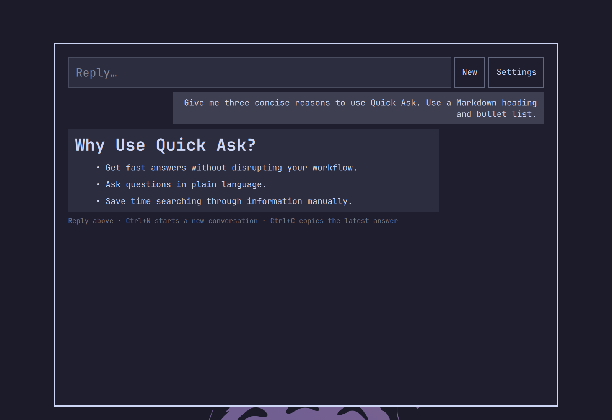

# Quick Ask

Quick Ask is a Raycast-style Omarchy overlay for short, conversational answers
without leaving the current workspace. It uses the authenticated agent selected
by `omarchy-default-agent` and renders a safe subset of Markdown.

Follow-up messages are conversational even though the underlying agent CLIs run
one request at a time. Quick Ask includes up to 24,000 characters of recent
context in the next request. The bounded transcript lives only in memory until
you close Quick Ask or start a new conversation, and is never written to disk.



## Requirements

- Omarchy Quattro
- Python 3
- An installed and authenticated **Codex** or **Claude Code** CLI
- That CLI selected with `omarchy default agent codex` or
  `omarchy default agent claude`
- An explicitly installed Hyprland binding if you want a global shortcut

Quick Ask deliberately does not install an agent, authenticate accounts, change
the selected default agent, or edit Hyprland configuration when the plugin is
installed or enabled.

## Install

Install and enable the plugin:

```bash
omarchy plugin add https://github.com/damianpoole/quick-ask.git --enable
```

Confirm that a supported authenticated agent is selected:

```bash
omarchy-default-agent
codex exec --ephemeral -s read-only - <<<"Reply with: ready"
```

For Claude, use `claude -p <<<"Reply with: ready"` for the authentication check.

Opt into the default **Super+grave** shortcut by running the bundled helper:

```bash
python3 ~/.config/omarchy/plugins/damianpoole.ask/scripts/bindings.py install
```

The helper first verifies that the key is free. If it is already assigned,
choose another key explicitly:

```bash
python3 ~/.config/omarchy/plugins/damianpoole.ask/scripts/bindings.py set "SUPER + CTRL + K"
```

It performs bounded, no-follow reads; creates a private backup; changes only a
marked Quick Ask block; and rolls back unless both `hyprctl reload` and
`hyprctl configerrors` succeed. It can also inspect the managed binding:

```bash
python3 ~/.config/omarchy/plugins/damianpoole.ask/scripts/bindings.py status
```

For manual setup, first use `omarchy menu keybindings --print` to choose a free
key. Then add this marked block to `~/.config/hypr/bindings.lua`:

```lua
-- BEGIN Quick Ask managed binding
o.bind("SUPER + GRAVE", "Quick Ask", "omarchy-shell shell toggle damianpoole.ask")
-- END Quick Ask managed binding
```

Run `hyprctl reload` followed by `hyprctl configerrors` after a manual edit.
You can test the plugin before adding the binding with:

```bash
omarchy-shell shell toggle damianpoole.ask
```

## Usage

- Press **Enter** to ask or reply.
- Press **Ctrl+N** to clear the in-memory conversation.
- Press **Ctrl+C** with an empty selection to copy the latest answer.
- Press **Esc** to close Quick Ask, clear the transcript, and cancel an active
  request.
- Select an HTTP(S) link to inspect its destination, then explicitly choose
  **Open** or **Cancel**. Other URL schemes are blocked.

Quick Ask inherits the selected CLI's model, account, and reasoning settings.
It does not maintain separate model preferences.

## Security boundaries

- Prompts are sent to the helper and agent through stdin, not argv or
  environment variables.
- Codex final output uses an anonymous in-memory file descriptor. Quick Ask does
  not create prompt, answer, or log files.
- Agent stdout and stderr have raw byte limits and a 120-second total deadline.
- Agent processes run in a separate process group and are terminated and reaped
  on timeout, overflow, cancellation, or helper shutdown.
- The optional binding helper caps config and command output, refuses symlinks
  and writable/unowned targets, uses descriptor-relative atomic replacement,
  and restores the original file if Hyprland validation fails.
- Codex runs with its read-only sandbox; Claude runs in plan permission mode.
- User, agent, status, and error strings render as plain text. Assistant Markdown
  has raw HTML and images disabled.
- The input, answer, error, protocol, URL, and retained transcript all have
  explicit size limits.

See [SECURITY.md](SECURITY.md) for the detailed limits and threat boundaries.

## Upgrading from 1.4 or earlier

Quick Ask no longer reads or writes its former settings file. An old file is
inert and can be removed manually if desired:

```bash
rm -f ~/.config/omarchy/plugin-settings/damianpoole.ask.json
```

## Remove

Remove the managed binding while the plugin directory still exists:

```bash
python3 ~/.config/omarchy/plugins/damianpoole.ask/scripts/bindings.py remove
```

Then remove the plugin:

```bash
omarchy plugin disable damianpoole.ask
omarchy plugin remove damianpoole.ask
```

If you configured the shortcut manually, remove the marked block and validate
Hyprland instead. The binding helper reports the private backup made beside
`bindings.lua`; retain or delete that backup according to your own dotfile
policy. The plugin creates no persistent conversation data or logs.

## Local development

Clone this repository separately from the runtime plugin directory, then clone
it into Omarchy's plugin folder:

```bash
git clone ~/git/quick-ask ~/.config/omarchy/plugins/damianpoole.ask
omarchy plugin enable damianpoole.ask
omarchy restart shell
```

Run the automated security tests and validators with:

```bash
bash tests/ask-test.sh
omarchy plugin validate .
qml_import_dir=$(mktemp -d)
ln -s "$OMARCHY_PATH/shell" "$qml_import_dir/qs"
/usr/lib/qt6/bin/qmllint -I "$qml_import_dir" Ask.qml
rm -rf -- "$qml_import_dir"
```

The temporary import symlink supplies qmllint with the `qs.*` module namespace;
it is not part of the plugin directory.

## License

MIT
